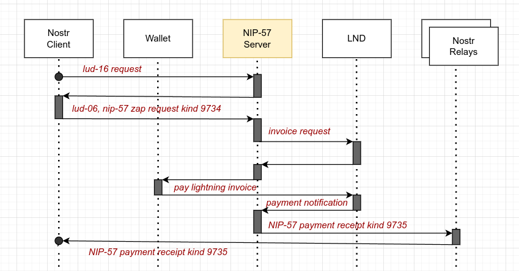

# NIP57 Server

A python server for lightning zaps in the Nostr network, facilitating a self hosted LND instance behind Tor. 
Use it to set up a server to recieve lightning zaps in The Nostr. Go self custody - not your keys, not your coins :-)
It's an alternative for Wallet Of Satoshi or getalby.com - but only for tec people.


> :warning: **This is Work In Progress**: It's not ready to be used by non-techs. Comment: I am used to code in C++ or
> Java, my Python may be bumpy sometimes...

## NIP-57 protocol flow
The protocol is documented in Nostr [NIP-57](https://github.com/nostr-protocol/nips/blob/master/57.md) - my implementation
looks like this:



## What it does

- Be a server
- Provide a lnurl pay endpoint like in [LUD-16](https://github.com/lnurl/luds/blob/luds/16.md), extended by the
  requirements in [NIP-57](https://github.com/nostr-protocol/nips/blob/master/57.md)
- Listen for zap requests kind 9734, REST - send them to the [LND](https://github.com/lightningnetwork/lnd), proxy that
  requests with Tor socks5h
- Deliver the bech32-serialized lightning invoice to the wallet [LUD-06](https://github.com/lnurl/luds/blob/luds/06.md)
- Listen at REST LND for invoice updates
- Create the NIP-57 kind 9735 Event and deliver it to the relays.

## What's missing

- Final tests
- Don't send around big amounts of money... it may fail.
- Handsome manual - how to set up a server in a rented cloud env

Estimated completion: End of 2023

## Prerequisites

You'll need a macaroon for your lnd. Bake it like
```lncli bakemacaroon --save_to=./nip57macaroon invoices:write invoices:read```

You'll need the onion address of your rest lnd interface, can find it usually in
```/var/lib/tor/lnd/hostname```

You'll need a tor proxy in SOCKS5H_PROXY. Use the docker compose if you don't have tor running on your host.

- create the users.json with the users you provide the service for
- cp the tls.cert from your lnd instance to here
- cp .env.example to .env and adjust the settings

## Startup

Start up and test looks like this:

```
docker logs nip57-server-server-1
[2023-12-07 08:53:08,658 - INFO] nip57_server NIP57S V1.0.1 starting on port 9080
[2023-12-07 08:53:08,658 - INFO] author contact: nostr:npub1c3lf9hdmghe4l7xcy8phlhepr66hz7wp5dnkpwxjvw8x7hzh0pesc9mpv4
[2023-12-07 08:53:08,658 - INFO] GitHub: https://github.com/raymonostr/nip57-server
[2023-12-07 08:53:08,658 - INFO] A server to receive nostr nip-57 zaps to my own self-custodial LND server.
[2023-12-07 08:53:08,658 - INFO] This software is provided AS IS without any warranty. Use it at your own risk.
[2023-12-07 08:53:08,658 - INFO] Config LNURL_ORIGIN: https://nostrich.house
[2023-12-07 08:53:08,659 - INFO] Config MIN_SENDABLE: 1000
[2023-12-07 08:53:08,659 - INFO] Config MAX_SENDABLE: 400000000
[2023-12-07 08:53:08,659 - INFO] Config DEFAULT_RELAYS: ['wss://nostr.mom/', 'wss://nostr-pub.wellorder.net/', 'wss://relay.damus.io/', 'wss://nos.lol/']
[2023-12-07 08:53:08,659 - INFO] Config SOCKS5H_PROXY: socks5h://tor_proxy:9150
[2023-12-07 08:53:08,659 - INFO] Config LND_RESTADDR: https://xxxxxxck...
[2023-12-07 08:53:08,659 - INFO] Config INVOICE_MACAROON: xxxxxxx6e6402...
[2023-12-07 08:53:08,659 - INFO] Config ZAPPER_KEY: xxxxxxxe05dab...
[2023-12-07 08:53:08,659 - INFO] Config DYNIP_SECRET: 7fH...
[2023-12-07 08:53:08,659 - INFO] Config TLS_VERIFY: ./tls.cert
[2023-12-07 08:53:08,662 - INFO] Serving on http://0.0.0.0:9080

# dynIP coming in:
[2023-12-07 08:53:49,457 - INFO] LND Rest addr set to https://y.z.29.216:8080

# zap coming in
[2023-12-07 08:55:46,177 - INFO] got invoice request for siddhartha amount 21000 msats
[2023-12-07 08:55:46,398 - INFO] Invoice cache length is 1
[2023-12-07 08:55:46,398 - INFO] Starting LND invoice listener
[2023-12-07 08:56:01,465 - INFO] Got payment of 21000 msats for idx 573
[2023-12-07 08:56:01,468 - INFO] Sending 9735 event to relays now
[2023-12-07 08:56:01,488 - INFO] LND invoice listener closed


raymon# curl localhost:9080/lnurlp/state
{"state":"SERVER_ACTIVE"}
```

The state request forwards to lnd rest /v1/state

## Dial-Up lines, Dyn-Ip

Tor is sometimes slow, to slow for some zap clients like damus or Amethyst. With the Dial-Up Dyn-Ip feature, you can connect the
nip57-server to lnd via clearnet. 

Path for this is ```/lnurlp/set_clearnet?secret=xyz&ipv4=18.19.20.21&port=8080&tls_verify=False```

The secret must be set in env.


## Issues welcome

Feel free to post issues or merge requests or zap me.

Raymon[@nostr](nostr:npub1c3lf9hdmghe4l7xcy8phlhepr66hz7wp5dnkpwxjvw8x7hzh0pesc9mpv4)

nostr:npub1c3lf9hdmghe4l7xcy8phlhepr66hz7wp5dnkpwxjvw8x7hzh0pesc9mpv4

## Version history

### NIP57S V0.8.0 beta
- added DynIp DialUp feature
