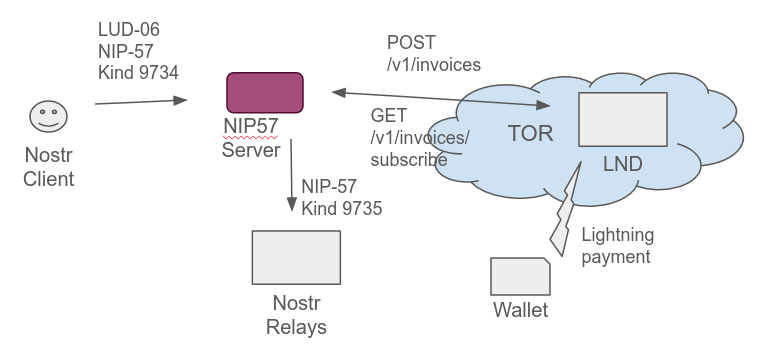

# NIP57 Server

A python server for lightning zaps in the Nostr network, facilitating a self hosted LND instance behind Tor.



> :warning: **This is Work In Progress**: It's not ready to be used by non-techs. Comment: I am used to code in C++ or
> Java, my Python may be bumpy sometimes...

## What it does

- Be a server
- Provide a lnurl pay endpoint like in [LUD-16](https://github.com/lnurl/luds/blob/luds/16.md), extended by the
  requirements in [NIP-57](https://github.com/nostr-protocol/nips/blob/master/57.md)
- Listen for zap requests kind 9734, REST - send them to the [LND](https://github.com/lightningnetwork/lnd), proxy that
  requests with Tor socks5h
- Deliver the bech32-serialized lightning invoice to the wallet [LUD-06](https://github.com/lnurl/luds/blob/luds/06.md)
- Listen at REST LND for invoice updates
- Create the NIP-57 kind 9735 Event and deliver it to the relays.

## What's missing

- Final tests
- Don't send around big amounts of money... it may fail.
- Handsome manual - how to set up a server in a rented cloud env

Estimated completion: End of 2023

## Prerequisites

You'll need a macaroon for your lnd. Bake it like
```lncli bakemacaroon --save_to=./nip57macaroon invoices:write invoices:read```

You'll need the onion address of your rest lnd interface, can find it usually in
```/var/lib/tor/lnd/hostname```

You'll need a tor proxy in SOCKS5H_PROXY. Use the docker compose if you don't have tor running on your host.

- create the users.json with the users you provide the service for
- cp the tls.cert from your lnd instance to here
- cp .env.example to .env and adjust the settings

## Issues welcome

Feel free to post issues or merge requests or zap me.

Raymon[@nostr](nostr:npub1c3lf9hdmghe4l7xcy8phlhepr66hz7wp5dnkpwxjvw8x7hzh0pesc9mpv4)

nostr:npub1c3lf9hdmghe4l7xcy8phlhepr66hz7wp5dnkpwxjvw8x7hzh0pesc9mpv4
